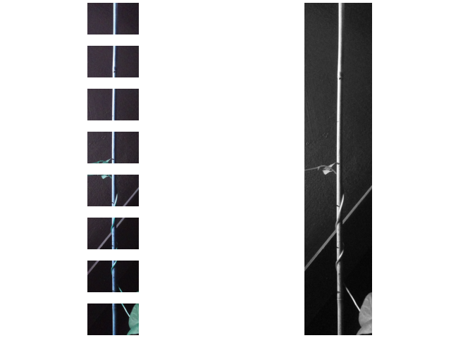

# Pole_runner
 
Find the pole in the image. 
get an angle based on the largest shape in a black and white version of the image

rotate the image based on the angle

create slices along the pole and save them in the results folder

